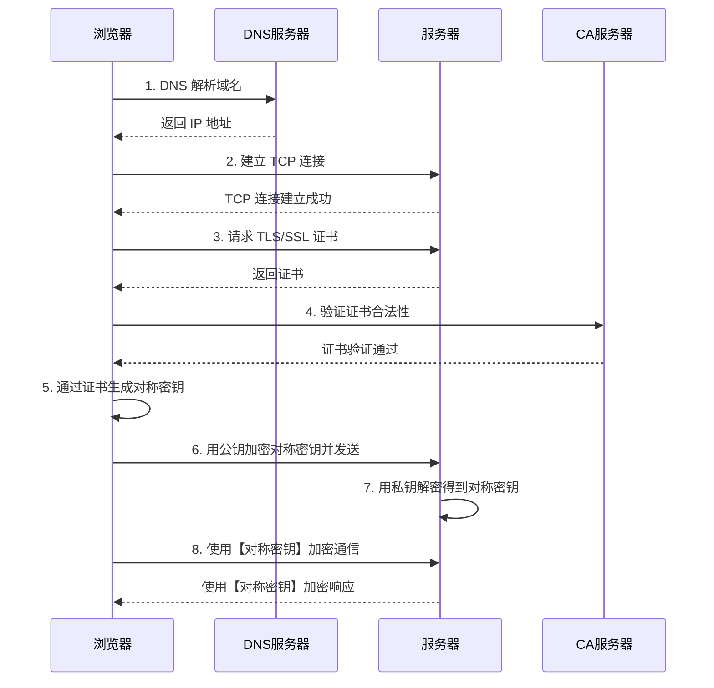

## 一、OSI 七层、TCP/IP 五层

### 网络模型对比

传输层及以下三层共四层协议不可更改，传输层协议之上的三层可以自己定义（统称应用层）。

```
OSI 七层模型              TCP/IP 五层模型
┌─────────────┐
│  应用层      │           
├─────────────┤           ┌─────────────┐
│  表示层      │           │  应用层      │
├─────────────┤           │             │
│  会话层      │           │             │
├─────────────┤           ├─────────────┤
│  传输层      │           │  传输层      │
├─────────────┤           ├─────────────┤
│  网络层      │           │  网络层      │
├─────────────┤           ├─────────────┤
│  数据链路层   │           │  数据链路层   │
├─────────────┤           ├─────────────┤
│  物理层      │           │  物理层      │
└─────────────┘           └─────────────┘
```

---

### 各层常用协议

| 网络层次 | 协议/标准 | 说明 |
|---------|----------|------|
| **应用层** | HTTP/HTTPS | 超文本传输协议，用于 Web 浏览 |
| | FTP | 文件传输协议，用于文件上传下载 |
| | SMTP | 简单邮件传输协议，用于发送邮件 |
| | POP3/IMAP | 邮件接收协议 |
| | DNS | 域名系统，用于域名解析 |
| | Telnet | 远程登录协议 |
| | SSH | 安全外壳协议，用于加密远程登录 |
| | DHCP | 动态主机配置协议，用于自动分配 IP 地址 |
| **表示层** | JPEG | 图像压缩标准 |
| | MPEG | 视频压缩标准 |
| | ASCII | 字符编码标准 |
| | XDR | 外部数据表示标准 |
| **会话层** | NetBIOS | 网络基本输入输出系统 |
| | RPC | 远程过程调用 |
| | SQL | 结构化查询语言（数据库会话） |
| **传输层** | TCP | 传输控制协议，面向连接的可靠传输 |
| | UDP | 用户数据报协议，无连接的不可靠传输 |
| | SCTP | 流控制传输协议 |
| **网络层** | IP | 网际协议（IPv4/IPv6） |
| | ICMP | 互联网控制消息协议（如 ping 命令） |
| | IGMP | 互联网组管理协议 |
| | ARP | 地址解析协议，IP 地址转 MAC 地址 |
| | RARP | 反向地址解析协议 |
| | RIP | 路由信息协议 |
| | OSPF | 开放最短路径优先 |
| | BGP | 边界网关协议 |
| **数据链路层** | Ethernet | 以太网协议 |
| | PPP | 点对点协议 |
| | HDLC | 高级数据链路控制 |
| | VLAN | 虚拟局域网 |
| | MAC | 媒体访问控制 |
| **物理层** | IEEE 802.3 | 以太网物理层标准 |
| | IEEE 802.11 | 无线局域网标准（Wi-Fi） |
| | RS-232 | 串行通信标准 |
| | USB | 通用串行总线 |
| | 传输介质 | 光纤、双绞线、同轴电缆等 |

---

### 各层详解

#### 应用层、表示层、会话层（统称应用层）

**特点**：
- 都是基于传输层来扩展的
- 非必要（类似于传输层提供基础通信，往上三层基于基础通信加格式）
- 可以自定义协议

#### 传输层（重点⭐️）

**作用**：侧重于传输，确保传输的数据 100% 正确

**协议**：
- TCP：确保数据传输的可靠性
- UDP：提供无连接的数据传输服务

**注意**：SSL/TLS 协议位于应用层与传输层之间，为应用层提供加密服务，不属于传输层本身

#### 网络层

**作用**：整个广域网中的 IP 寻址

#### 数据链路层

**作用**：保障信号在多设备之间精准传输

**特点**：
- 局域网内通信
- 通过设备 MAC 地址进行寻址

#### 物理层

**作用**：
- 保障两个设备之间通信
- 定义电信号高低电压如何传输

---

## 二、TCP/UDP 协议

### 1. 简介

| 协议 | 全称 | 特点 |
|------|------|------|
| **TCP** | Transmission Control Protocol<br>（传输控制协议） | 提供**面向连接**的，**可靠**的数据传输服务 |
| **UDP** | User Datagram Protocol<br>（用户数据协议） | 提供**无连接**的，**尽最大努力**的数据传输服务<br>（不保证数据传输的可靠性） |

---

### 2. TCP/UDP 区别

| 特性 | TCP | UDP |
|------|-----|-----|
| **连接性** | 面向连接 | 无连接 |
| **可靠性** | 可靠传输，使用流量控制和拥塞控制 | 不可靠传输，不使用流量控制和拥塞控制 |
| **连接对象** | 只能是一对一通信 | 支持一对一、一对多、多对一和多对多交互通信 |
| **传输方式** | 面向字节流 | 面向报文 |
| **首部开销** | 首部最小 20 字节，最大 60 字节 | 首部开销小，仅 8 字节 |
| **适用场景** | 适用于要求可靠传输的应用<br>例如：文件传输 | 适用于实时应用<br>例如：视频会议、直播 |

---

## 三、TCP 三次握手和四次挥手

### 1. 三次握手

**过程**：

1. **第一次握手**：客户端发送带有 **SYN** 标志的数据包 → 服务端
2. **第二次握手**：服务端发送带有 **SYN/ACK** 标志的数据包 → 客户端
3. **第三次握手**：客户端发送带有 **ACK** 标志的数据包 → 服务端

---

### 2. 为什么要三次握手？

**目的**：为了双方有一个可靠的连接（即双方的发送/接收功能都没问题）

**详细分析**：

| 步骤 | 过程 | 确认内容 |
|------|------|---------|
| A → B | 客户端发送 SYN | 服务端确认：自己**接收**没问题 |
| A ← B | 服务端发送 SYN/ACK | 客户端确认：<br>1. 自己第一次**发送**没问题<br>2. 自己**接收**没问题 |
| A → B | 客户端发送 ACK | 服务端确认：自己上一次**发送**没问题 |

**结论**：至此，双方都确认自己的接收和发送功能都没问题。

---

### 3. 四次挥手

**过程**：

1. **第一次挥手**：客户端发送一个 **FIN**，用来关闭客户端到服务器的数据传送
2. **第二次挥手**：服务器收到这个 FIN，它发回一个 **ACK**，确认序号为收到的序号加 1
   - 和 SYN 一样，一个 FIN 将占用一个序号
3. **第三次挥手**：服务器关闭与客户端的连接，发送一个 **FIN** 给客户端
4. **第四次挥手**：客户端发回 **ACK** 报文确认，并将确认序号设置为收到序号加 1

---

### 4. 为什么要四次挥手？

**目的**：为了双方都确认自己的断开对方知道了，并且对方的断开自己知道了

**详细分析**：

| 步骤 | 过程 | 说明 |
|------|------|------|
| A → B | 客户端发送断开请求（FIN） | 服务端知道了客户端要断开<br>（需要给客户端回复） |
| A ← B | 服务端发送确认（ACK） | 客户端确认：自己断开请求对方收到了<br>但客户端不知道服务端要不要断开<br>只能等服务端发断开消息 |
| A ← B | 服务端发送断开请求（FIN） | 客户端知道了服务端要断开<br>（需要给服务端回复） |
| A → B | 客户端发送确认（ACK） | 服务端确认：自己断开请求对方收到了 |

**结论**：至此，双方都断开，并且对方都知道了。

---

### 🌰 举个栗子

A 和 B 打电话，通话即将结束后：

1. **A 说**："我没啥要说的了"
2. **B 回答**："我知道了"
3. 但是 B 可能还会有要说的话，A 不能要求 B 跟着自己的节奏结束通话
4. 于是 B 可能又巴拉巴拉说了一通
5. 最后 **B 说**："我说完了"
6. **A 回答**："知道了"

这样通话才算结束。

---

## 四、TCP 协议如何保证可靠传输

TCP 通过以下机制保证可靠传输：

### 1. 分块

应用数据被分割成 TCP 认为最适合发送的数据块。

### 2. 编号

TCP 给发送的每一个包进行编号，接收方对数据包进行排序，把有序数据传送给应用层。

### 3. 校验和

TCP 将保持它首部和数据的检验和：
- 这是一个**端到端的检验和**
- 目的是检测数据在传输过程中的任何变化
- 如果收到段的检验和有差错，TCP 将丢弃这个报文段和不确认收到此报文段

### 4. 丢弃重复数据

TCP 的接收端会丢弃重复的数据。

### 5. 流量控制

**机制**：TCP 连接的每一方都有固定大小的缓冲空间

**作用**：
- TCP 的接收端只允许发送端发送接收端缓冲区能接纳的数据
- 当接收方来不及处理发送方的数据时，能提示发送方降低发送的速率
- 防止包丢失

**实现**：TCP 使用的流量控制协议是**可变大小的滑动窗口协议**

### 6. 拥塞控制

当网络拥塞时，减少数据的发送。

### 7. ARQ 协议

**基本原理**：
- 每发完一个分组就停止发送，等待对方确认
- 在收到确认后再发下一个分组

### 8. 超时重传

**机制**：
- 当 TCP 发出一个段后，它启动一个定时器
- 等待目的端确认收到这个报文段
- 如果不能及时收到一个确认，将重发这个报文段

---

## 五、在浏览器中输入 URL 地址 → 显示主页的过程

### 完整流程

#### 1. DNS 解析

将域名解析为 IP 地址。

#### 2. 发送 HTTP 请求

- Cookie 会随着请求发送给服务器

#### 3. TCP 连接

- 把 HTTP 请求报文分割成数据段，方便传输

#### 4. 服务器处理请求并返回 HTTP 报文

- 服务器接收请求
- 处理业务逻辑
- 返回响应数据

#### 5. 浏览器解析渲染页面

- 解析 HTML
- 解析 CSS
- 执行 JavaScript
- 渲染页面

#### 6. 连接结束

- 断开 TCP 连接

---

### GET 请求 vs POST 请求

#### GET 请求

**使用角度**：向服务器请求某个资源

**特点**：
- ✅ GET 请求通过 **URL 地址**传输参数
- ⚠️ 传输数据的大小受到 URL 路径长度的限制
- 📦 GET 产生**一个** TCP 数据包
  - 浏览器会把 http header 和 data 一并发送出去
  - 服务器响应 200（返回数据）

#### POST 请求

**使用角度**：向服务器写入某个资源

**特点**：
- ✅ POST 通过 **request body** 传递参数
- 📦 POST 产生**两个** TCP 数据包
  - 浏览器先发送 header，服务器响应 100 continue
  - 浏览器再发送 data，服务器响应 200 ok
- 🔒 POST 相对来说更安全，因为 GET 参数明文传输在地址栏

---

## 六、HTTP 状态码

### 状态码分类

| 状态码 | 类别 | 说明 |
|--------|------|------|
| **1xx** | Informational（信息性状态码） | 接收的请求正在处理 |
| **2xx** | Success（成功状态码） | 请求正常处理完毕 |
| **3xx** | Redirection（重定向状态码） | 需要进行附加操作以完成请求 |
| **4xx** | Client Error（客户端错误状态码） | 服务器无法处理请求 |
| **5xx** | Server Error（服务器错误状态码） | 服务器处理请求出错 |

---

### 常见状态码

| 状态码 | 含义 |
|--------|------|
| **200 OK** | 请求成功 |
| **204 No Content** | 请求成功，但响应报文不含实体的主体部分 |
| **206 Partial Content** | 进行范围请求成功 |
| **301 Moved Permanently** | 永久性重定向 |
| **302 Found** | 临时性重定向 |
| **303 See Other** | 表示资源存在另一个 URI，应使用 GET 方法获取资源 |
| **304 Not Modified** | 资源未修改，可使用缓存 |
| **307 Temporary Redirect** | 临时重定向，和 302 含义类似，但是期望客户端保持请求方法不变 |
| **400 Bad Request** | 请求报文存在语法错误 |
| **401 Unauthorized** | 请求需要有通过 HTTP 认证的认证信息 |
| **403 Forbidden** | 请求资源的访问被服务器拒绝 |
| **404 Not Found** | 服务器上没有找到请求的资源 |
| **500 Internal Server Error** | 服务器端在执行请求时发生了错误 |
| **503 Service Unavailable** | 服务器暂时处于超负载或正在进行停机维护，现在无法处理请求 |

---

## 七、HTTP 长连接、短连接

### 短连接（HTTP/1.0 默认）

**特点**：
- 客户端和服务器每进行一次 HTTP 操作，就建立一次连接
- 任务结束就中断连接

**示例场景**：
- 当客户端浏览器访问的某个 HTML 或其他类型的 Web 页中包含有其他的 Web 资源（如 JavaScript 文件、图像文件、CSS 文件等）
- 每遇到这样一个 Web 资源，浏览器就会重新建立一个 HTTP 会话

---

### 长连接（HTTP/1.1 默认）

**特点**：
- 从 HTTP/1.1 起，默认使用长连接
- 用以保持连接特性

**响应头标识**：

```http
Connection: keep-alive
```

**注意事项**：
- Keep-Alive 不会永久保持连接
- 它有一个保持时间，可以在不同的服务器软件（如 Apache）中设定这个时间
- 实现长连接需要**客户端和服务端都支持长连接**

---

## 九、HTTP 是不保存状态的协议，如何保存用户状态？

### 问题

HTTP 是一种**不保存状态**，即**无状态（stateless）**协议。

也就是说 HTTP 协议自身不对请求和响应之间的通信状态进行保存。

---

### 解决方案：Session 机制

**Session 的主要作用**：通过服务端记录用户的状态

**工作原理**：
1. 服务端给特定的用户创建特定的 Session
2. 这样就可以标识这个用户并且跟踪这个用户了
3. 一般情况下，服务器会在一定时间内保存这个 Session
4. 过了时间限制，就会销毁这个 Session

---

### Session 存储方式

**常用的存储方式**：
- ✅ 内存
- ✅ 数据库（比如使用内存数据库 Redis 保存）

---

### Session 跟踪方式

#### 方式 1：通过 Cookie

**原理**：
- 在 Cookie 中附加一个 **Session ID** 来跟踪

#### 方式 2：URL 重写（Cookie 被禁用时）

**原理**：
- 利用 **URL 重写**把 Session ID 直接附加在 URL 路径的后面

---

## 十、Cookie 的作用是什么？和 Session 有什么区别？

### Cookie

**作用**：一般用来保存用户信息

**示例**：
- 登录信息
- 登录之后可以访问该网站所有页面

**安全建议**：
- ⚠️ Cookie 中存储一些敏感信息，不要直接写入 Cookie 中
- ✅ 最好能将 Cookie 信息加密，然后使用时再去服务器端解密

---

### Session

**作用**：主要作用就是通过服务端记录用户的状态

**典型场景**：
- 购物车：当你要添加商品到购物车的时候，系统不知道是哪个用户操作的
- 因为 HTTP 协议是无状态的，所以需要 Session 来记录用户状态

---

### Cookie vs Session

| 特性 | Cookie | Session |
|------|--------|---------|
| **存储位置** | 保存在客户端（浏览器端） | 保存在服务器端 |
| **安全性** | 相对不安全 | 安全性更高 |
| **存储容量** | 单个 Cookie 保存的数据不能超过 4KB | 理论上无限制（受服务器资源影响） |
| **生命周期** | 可以设置过期时间，长期有效 | 默认会话结束即失效，可设置超时时间 |

---

## 十一、URI 和 URL 的区别

### URI（Uniform Resource Identifier）

**定义**：统一资源标志符

**作用**：可以唯一标识一个资源

---

### URL（Uniform Resource Location）

**定义**：统一资源定位符

**作用**：可以提供该资源的路径

**特点**：
- 它是一种具体的 URI
- URL 可以用来标识一个资源
- 而且还指明了如何 **locate**（定位）这个资源

---

### 关系

```
URI
└── URL（URL 是 URI 的子集）
```

> 💡 **简单理解**：URL 是 URI 的一种实现方式，所有的 URL 都是 URI，但不是所有的 URI 都是 URL。

---

## 十二、HTTP 版本对比

### 1. HTTP 1.0 vs HTTP 1.1

| 特性 | HTTP 1.0 | HTTP 1.1 |
|------|----------|----------|
| **连接方式** | 默认短连接 | 默认长连接 |
| **Host 头** | 不支持 | 必须支持 Host 头域<br>请求消息中如果没有 Host 头域会报 400 错误 |
| **带宽优化** | 不支持断点续传 | 支持只发送 header 信息，节省带宽 |
| **缓存处理** | 使用 If-Modified-Since | 引入了更多的缓存控制策略<br>如 Entity tag，If-Unmodified-Since 等 |
| **错误状态码** | 较少 | 增加了 24 个错误状态码 |

**Host 头的必要性**：
- 现在一个物理机可能有多台虚拟主机
- 它们共享一个 IP 地址
- 通过 Host 头来区分访问哪个虚拟主机

---

### 2. HTTP 1.x vs HTTP 2.0

#### 多路复用（重要⭐️）

**定义**：连接共享，即每一个 request 都使用作连接共享机制

**优势**：
- 同一个连接可以并发处理多个请求
- 解决了 HTTP 1.x 的队头阻塞问题

---

#### 新的二进制格式

**HTTP 1.x**：解析是基于文本的

**HTTP 2.0**：
- 协议解析采用二进制格式
- 实现方便且健壮

---

#### Header 压缩

**问题**：HTTP 1.x 的 header 带有大量信息，而且每次都要重复发送

**解决方案**：
- HTTP 2.0 使用 **encoder** 来减少需要传输的 header 大小
- 通讯双方各自 cache 一份 header fields 表
- 既避免了重复 header 的传输
- 又减小了需要传输的大小

---

## 十三、HTTPS

### 定义

**HTTPS**：Hypertext Transfer Protocol Secure（超文本传输安全协议）

**组成**：
```
HTTPS = HTTP + TLS/SSL
```

**协议栈**：
- HTTPS 经由 HTTP 进行通信
- 但利用 TLS/SSL 来保证安全
- HTTPS 是运行在 SSL/TLS 之上的 HTTP 协议
- SSL/TLS 运行在 TCP 之上

---

### HTTPS 的一次请求流程



---

#### 详细步骤说明

#### 1. DNS 解析域名

可以从以下位置获取域名对应的 IP 地址：
- 浏览器缓存
- 路由器缓存
- 交换机缓存
- DNS 服务器

---

#### 2. 建立 TCP 连接

浏览器封装一个 HTTP 请求，和服务器建立一个 TCP 连接。

#### 3. 获取 TLS/SSL 证书

浏览器获取到服务器的 TLS 或者说 SSL 证书。

#### 4. 验证证书

去 CA 服务器验证证书的合法性。

> 💡 **注意**：CA 已经把根证书存到了我们的操作系统中。

#### 5. 生成对称密钥

浏览器通过证书里面的**公钥**加密一个**对称密钥**。

#### 6. 传输加密的对称密钥

将加密后的对称密钥发送给服务器。

---

#### 7. 服务器解密

服务器收到密文，通过**私钥**解密得到**对称密钥**。

---

#### 8. 加密通信

双方通过对称密钥进行通信与传输数据。

---

### 对称加密 vs 非对称加密

#### 对称加密

**特点**：
- 密钥只有一个
- 加密解密为同一个密码
- 加解密速度快

**典型算法**：
- DES
- AES

---

#### 非对称加密

**特点**：
- 密钥成对出现（公钥 + 私钥）
- 根据公钥无法推知私钥，根据私钥也无法推知公钥
- 加密解密使用不同密钥
  - **公钥加密**需要**私钥解密**
  - **私钥加密**需要**公钥解密**
- 相对对称加密速度较慢

**典型算法**：
- RSA
- DSA

---

### HTTPS 和 HTTP 的区别

| 特性 | HTTP | HTTPS |
|------|------|-------|
| **传输方式** | 明文传输 | 密文传输 |
| **默认端口** | 80 | 443 |
| **CA 证书** | 不需要 | 需要 CA 证书验证身份 |
| **安全性** | HTTP | HTTPS = HTTP + 加密 + 认证 + 完整性保护 |
| **性能** | 较快 | 较慢（需要加密解密） |
| **SEO** | 一般 | 搜索引擎更偏好 HTTPS |

---

> 📚 **参考资料**：本文内容基于个人学习笔记整理
