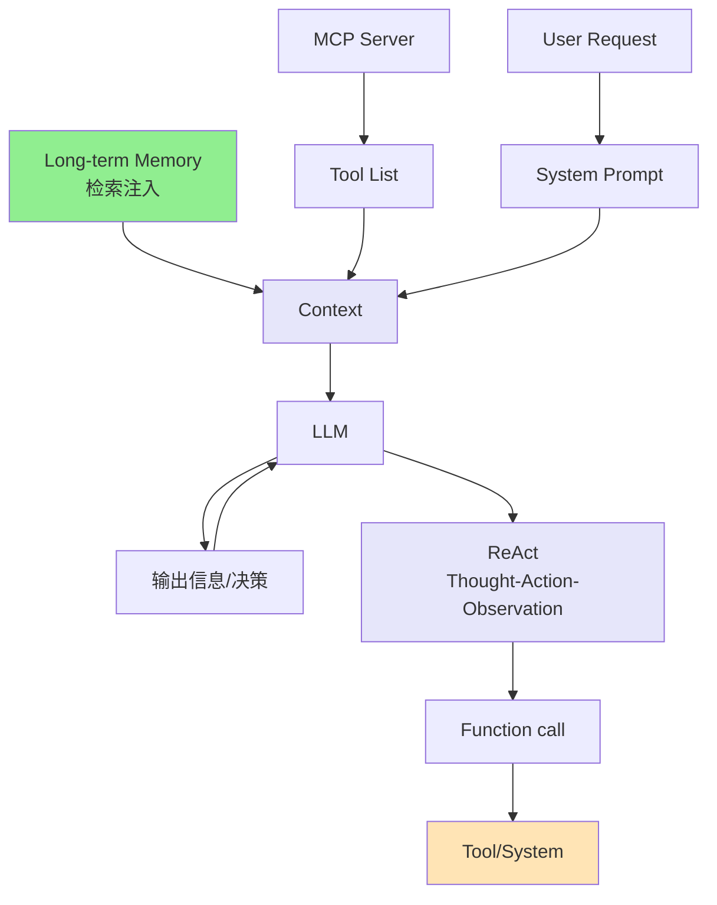
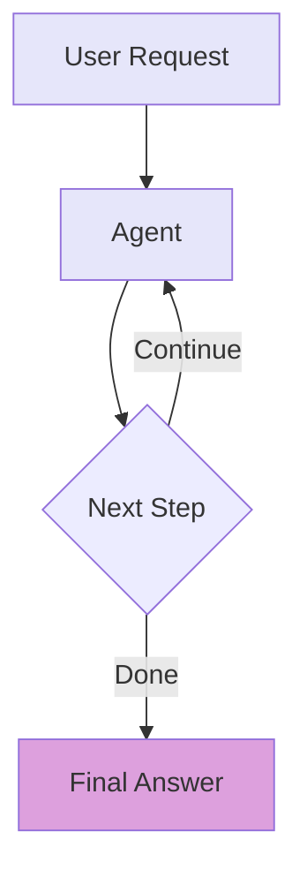
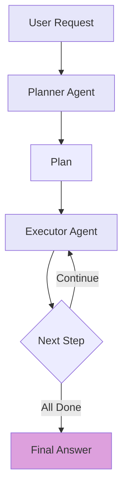
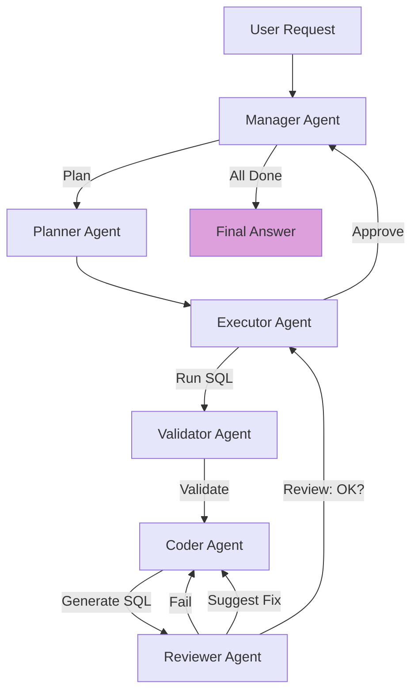
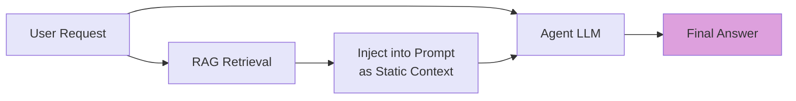
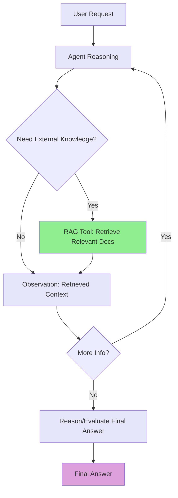

## 一、什么是 Agent？

我首次接触 Agent 源自 2023年6月 OpenAI 团队的 Lilian Weng 发表的博客《[LLM Powered Autonomous Agents](https://lilianweng.github.io/posts/2023-06-23-agent/)》。Agent 是在 LLM 基础上进化而来，从单纯"大脑"进化出了手脚，拥有了目标、更接近一个完整的人，中文也被叫做"智能体"，所以 Agent 的四大核心能力：**目标驱动、工具使用、记忆保持、自主决策**，有些人会把简单的 RAG+LLM 误认为是 Agent，这是不恰当的，这个智能体缺少了工具这只手脚，能力太重限。

## 二、Agent 的四大核心能力

接下来以一个例子来说明 Agent 中几个核心能力。

**用户提出一个模糊但典型的工程需求："帮我创建一张店铺日粒度汇总表，包含昨日每家店铺的订单数和 GMV。"**

### 1. 目标驱动（Planning - 任务分解）

Agent 首先将任务分解为若干子目标：
- 确认表结构
- 生成建表与插入 SQL
- 执行验证
- 处理可能的错误
- 最终交付结果

这实现了**任务分解（Task Decomposition）**能力。

### 2. 工具使用（Tool Use）

Agent 调用 `read_table_schema("dwd_order")` 查看源表字段，确认可用字段包括 `shop_id`、`order_time`、`amount`、`status`。

基于理解，Agent 生成 SQL 脚本并调用 `write_file("dws_daily.sql", sql)` 保存。

接着调用 `execute_sql("dws_daily.sql")` 执行——但返回错误："`amount` 字段在 NULL 值，SUM 聚合失败"。

### 3. 记忆保持 + 自主决策（Memory + Self-Reflection）

Agent 记住该错误类型，并进行自我反思："未处理空值是常见疏漏，应在聚合前使用 COALESCE。"

于是，Agent 自主修正 SQL 逻辑，将 `SUM(amount)` 改为 `SUM(COALESCE(amount, 0))`，并再次调用 `write_file("dws_daily_v2.sql", fixed_sql)`。

### 4. 最终执行与总结

Agent 再次调用 `execute_sql("dws_daily_v2.sql")`，执行成功，返回"插入 1,248 行"。

最终向用户反馈："已成功创建 `dws_shop_daily` 表，初始版本已处理 NULL 值失败，已自动修正并重试成功。"

## 三、四大能力映射

- **目标驱动** ←→ Planning（任务分解）
- **工具使用** ←→ Tool Use（调用外部能力扩展 LLM）
- **记忆保持** ←→ Short-term Memory（保留错误上下文）
- **自主决策** ←→ Self-Reflection + ReAct（从观察中学习并修正）

正如 Lilian Weng 所强调："An agent needs body (tools), memory, and planning — not just a language model."

## 四、关键基础概念澄清

### Function Calling vs. MCP (Model Context Protocol)

#### ❌ 混淆点 1："MCP 是 Function Calling 的替代方案"

✅ **实际情况**：MCP 和 Function Calling 不是竞争关系，而是互补关系。

✅ **正确理解**：
- **MCP 定义工具**（What & How to describe tools）
- **Function Calling 执行调用**（How to ask for a tool）
- 二者分别作用于**系统设计时**（MCP 注册）和**模型推理时**（Function Calling 输出）

✅ **协作影响**：误以为"上了 MCP 就不用关心是否支持 Function Calling"，可能导致系统依赖脆弱的后处理逻辑（如正则解析），降低可靠性。

#### 详细解读

**一句话定义**

- **Function Calling** 是大模型（LLM）的一项**原生能力**，指模型能根据用户请求，结构化地输出调用工具、传什么参数（如 JSON 格式），但不涉及工具本身如何定义或发现。
- **MCP (Model Context Protocol)** 是一套**标准化协议**，用于描述、注册、发现和调用工具，解决"Agent 如何知道有哪些工具可用、每个工具怎么用"的问题。

**支持关系**

- 一个模型可以支持 Function Calling，但完全不知道 MCP
- 例如：GPT-4、Qwen-Max 原生支持 Function Calling，但它们本身不"理解"MCP；MCP 是由 Agent 框架（如 LangChain、Spring-AI等）提供的元数据协议。
- 反之，一个系统支持 MCP，但底层模型不支持 Function Calling，则无法自动调用工具
- 此时需人工拼接 prompt（如用 few-shot 引导模型输出特定格式），或依赖后处理解析非结构化输出，并将项目引入 cline 采用了这个方案，让模型输出约定的 XML 格式。
- 最佳实践是协作

**总结**

在 Agent 世界中，Function Calling 是 LLM 的方言，MCP 是工具的通用语，Agent 框架是翻译官，MCP Server 是行动者——四者协同，才让"会思考的 AI"变多"更多"事情。

### Prompt vs. Context vs. Memory

三者构成了这送给大模型的最终输入，但是形成的时机、生成的方式不同

相关存在的词还有：Prompt Engineering、Context Engineering、Long-term Memory、Short-term Memory...

#### ❌ 混淆点 1："Prompt 就是给模型的全部输入，Context 和 Memory 都是 Prompt 的一部分"

✅ **实际情况**：

- **Prompt** 是人工设计的静态指令（如系统角色、任务描述）
- **Context** 是运行时动态构建的完整 token 序列，包含 Prompt + 工具描述 + ReAct 历史 + Memory 检索结果
- **Memory (Long-term)** 是外部知识库，通过检索注入 Context，并非直接等同于 Prompt

✅ **协作影响**：若工程团队认为"优化 Prompt 就够了"，而忽略 Context 工程（如 Observation 压缩、Memory 检索策略），会导致长任务性能下降、推理漂移。

#### ❌ 混淆点 2："Memory 就是上下文，用得越多越好"

✅ **实际情况**：

- **Short-term memory = Context**（受 token 限制，自动丢弃）
- **Long-term memory = 向量库**（需主动检索、按需注入）
- 无差别注入大量 Memory 会污染 Context，稀释关键信息，反而降低模型表现

✅ **协作影响**：产品可能要求"记住所有历史"，但工程需设计重要性评分 + 检索过滤机制，否则上下文逼近极限，Agent 失效。

#### ❌ 混淆点 3："能看到最近几轮对话，只是 Short-term Memory（即 Context）的体现，受限于模型上下文窗口（如 256K tokens），超出即丢弃"

✅ **实际情况**：

- 能看到最近几轮对话，只是 **Short-term Memory（即 Context）** 的体现，受限于模型上下文窗口（如 256K tokens），超出即丢弃
- 真正的 **Long-term Memory** 需要外部向量存储，能跨会话、跨任务持久化并检索关键经验（如"上次用户要求处理 NULL 值"）

✅ **正确理解**：

- **Short-term memory = in-context learning**，是临时、有限的
- **Long-term memory = external vector store + retrieval**，是持久、可扩展的
- 仅靠历史记录无法支持"越用越聪明"的 Agent 行为

✅ **协作影响**：若产品认为"已有记忆能力"，但工程仅依赖上下文历史，则在多轮/跨天任务中无法复用关键经验，导致 Agent 表现"健忘"，反复回到同问题或重复已验证。

#### 详细解读

**Context**

定义（来自 Lilian Weng）：

> "I would consider all the in-context learning as utilizing short-term memory of the model."

Context 就是 short-term memory，即 LLM 当前推理所依赖的 token 窗口内容，包括系统 prompt、用户输入、历史对话、工具描述、工具返回结果等。

一句话：Prompt 是 Context 的子集。

在 Agent 系统中，Context = System Prompt + User Query + MCP 工具清单 + ReAct 的 Thought/Action/Observation 历史 + Memory 检索结果 + ......

**Memory**

定义（Lilian Weng 将 Memory 分为两类）：

- Short-term memory = Context（in-context learning）
- Long-term memory = 会话外的外部向量存储，用于跨轮次、跨任务的信息保留与检索

一句话：Long-term Memory = Agent 的"日记本"：它记下重要经历，供未来查询。

**Long-term Memory 的实现**：

一般是将关键事件（如成功 SQL、用户反馈、错误日志）以文本形式存入向量数据库，在下次会话的检索阶段向量数据库，然后将其加入 Context。

**Long-term Memory 意义**：

- 支持跨会话知识复用：用户说"像上次那样处理 NULL 值"，Agent 能召回历史
- 使 AI 能够从过去"过去"自己的经验中学习，这也是超越用心、超用越好用的原因
- 不稳定性是 LLM 的一个特点，所以长期记忆使用不当，也可能会造成超用越心，此时需要产品化的支持，如选出长期记忆内容，让记忆内容对用户透明等

注意：在不同的 Agent 框架实现中，概念可能有差异，比如 spring-ai 中有一个 Memory 的概念，他指代的是 ReAct 的 Thought/Action/Observation 历史，所以大家在实际中，还需要考虑具体框架的语境、语境。

**完整关系图**：

*Prompt vs. Context(short-term Memory) vs. Long-term Memory*

#### 扩展知识

如果你熟悉 LangGraph 等框架，它还有一个汉其相近的概念 **State**。State ≠ Context，也 ≠ Memory，**State 就是 Agent 在某一时刻的运行快照**，可用于备份与恢复。比如 Agent 运行到一刻，需要人类的介入而中断，此时就会打一个快照，等中断结束后，快速从此处照恢复。

| 阶段 | Prompt | Context | Long-term Memory | State |
|------|--------|---------|------------------|-------|
| 启动时 | 提供角色、约束、工具模板（如 ReAct 格式） | ← 由 Prompt 初始化 | 可能注入历史相关经验 | ← 初始化为空或默认值 |
| 运行中 | 静态不变 | 动态增长（Thought → Action → Observation） | 按需检索并注入 Context | 实时更新（如 `step=execute_sql`，`retry=2`） |
| 中断/恢复 | 仍可用 | ❌ 可能超长丢失 | 持久化存储 | 可序列化备份，用于断点恢复 |
| 进化（多轮迭代） | 通常不变 | 单次任务结束即丢弃 | 新经验写入，供未来使用 | 任务结束即销毁 |

**总结**：

Prompt 设定起点，Context 构成当下，Memory 积累过去，State 控制流程 —— 四者协同，Agent 才能既聪明又可靠。

### ReAct vs. Plan-and-Execute vs. Multi-Agent

这三种范式并非孤立存在，而是 Agent "思考"能力从简单到复杂、从单体到协作的演进路径。它们共享 Agent 的三大核心组件（Planning, Memory, Tool Use），但在决策粒度、执行结构和协作机制上各有侧重。区别不在于"有没有"，而在于"如何组织"这些能力。

#### ❌ 混淆点 1："ReAct 不能做复杂任务"

✅ **实际情况**：ReAct 的第一个 Thought 步骤天然支持成完整计划（如输出 5 步清单），后续 Action 可按计划执行，这本质上已是重量级 Plan-and-Execute。

✅ **正确理解**：

- ReAct 与 Plan-and-Execute 不是互斥，而是决策粒度不同
- 是否透出 Plan 给用户，更多是产品交互策略，而非能力差异

#### ❌ 混淆点 2："我们用的是 Plan-and-Execute 为什么不能自纠错"

✅ **实际情况**：系统缺乏有效的 Planner + Executor 模块。Planner 负责生成完整计划，Executor 严格按计划执行，但缺少 Reflexion 机制，执行出错时无法分析原因，也无法触发重新规划，只能报错、重试当前步骤或终止，不具备动态修正计划的能力。

✅ **正确理解**：

- Plan-and-Execute 的本质是"先规划、后执行"，计划一旦生成，执行过程常不修改其结构
- 自纠错（如调整步骤顺序、替换工具、补充前置条件）需要额外的反思思维循环（如 Reflexion），并非 P&E 自带能力
- 没有 Reflexion 的 P&E 是开环系统：执行失败不会导致计划更新，只会在原路径上复现或中断

✅ **协作影响**：若产品预期系统具备"执行失败后自动优化策略"的能力，但工程实现仅为标准 Plan-and-Execute（无 Reflexion），则对容错性和适应性的判断将产生重大偏差，导致用户在真实异常场景中体验崩溃式下降。

#### ❌ 混淆点 3："我们的 Agent 是 Multi-Agent 架构"

✅ **实际情况**：

- 有时只是单个 Agent 在不同阶段扮演不同角色（如先写代码、再自审的固定 flow），并未实现多 Agent 间的消息传递与协商
- 有时是多个专用 Agent 前面加一个意图识别模块（Router），由 Router 决定调用哪个 Agent，但各 Agent 之间无交互、无状态共享，本质上仍是单向调度，而非协作

✅ **正确理解**：

- Multi-Agent 的核心是多个独立 Agent 实例通过消息协作（如 Coder 与 Reviewer 对话）
- 如果只是同一个 LLM 在不同步骤切换"身份"，仍属于单体 Agent
- 如果多个 Agent 仅由 Router 单向分发任务，彼此不通信，也属于"伪 Multi-Agent"，真实结构是"Router + 单体 Agent 集合"

✅ **协作影响**：

- 高可靠场景（如生成生产级 SQL）若误判为 Multi-Agent，可能低估单点黑盒风险
- 若将 Router + 多 Agent 误认为具备协同纠错能力，可能忽视 Router 误判或下游 Agent 缺乏反馈机制带来的系统性错误

#### 详细解读

**ReAct (Reasoning + Acting) —— 边想边做**

**核心机制**

- Agent 在每一步交替输出：
  - **Thought**：推理当前状态（"我需要查表结构"）
  - **Action**：调用工具（如 `read_table_schema`）
  - **Observation**：接收工具返回结果
- 该循环不断，直至任务完成

ReAct 的关键创新在于将推理显式化，通常 LLM 直接"跳"到结论，从而提升可解释性与工具调用准确性。

**✅ 示例：创建店铺日粒度汇总表**

用户输入："帮我创建一张店铺日粒度汇总表，包含昨日每家店铺的订单数和GMV"

- **Step 1**
  - Thought: "需确认源表字段。"
  - Action: `read_table_schema("dwd_order")`
  - Observation: `{columns: ["shop_id", "amount", "order_time", "status"]}`

- **Step 2**
  - Thought: "生成建表 + 插入 SQL。"
  - Action: `write_file("dws_daily.sql", sql)`
  - Observation: `File written.`

- **Step 3**
  - Thought: "执行 SQL。"
  - Action: `execute_sql("dws_daily.sql")`
  - Observation: `Error: amount is NULL in some rows.`

- **Step 4**
  - Thought: "需用 COALESCE 处理 NULL。"
  - Action: 修正 SQL → 重试 → 成功。

*ReAct*

**✅ 适用场景**

- 任务链较短
- 工具调用逻辑链路清晰
- 可接受试错

**❌ 局限**

- 无全局计划：易在复杂任务中迷失
- 错误累积：早期误判难以回溯
- 上下文膨胀：长任务可能超出 token 限制

这些局限基本与模型性能有关，随着模型能力的加强，局限越来越弱。

**Plan-and-Execute —— 先规划，后执行**

**核心机制**

- **Plan-and-Execute（先规划后执行）**：全局可控，适合复杂分析流水线
- **AutoGen（多智能体协作）**：模拟团队分工，适合需多角色协调的场景

此范式将"思考"前置，把复杂问题分解为多个可验证的子目标，符合工程化思维。

**✅ 示例：同上任务**

- **Planner 输出**：
  1. 读取 `dwd_order` 表结构
  2. 生成 dws 表 DDL 与 DML
  3. 执行 SQL
  4. 若失败，检查 NULL 字段并修正
  5. 验证输出表行数与字段

- **Executor 按计划执行**，每步记录状态（如 `step=3, retry=1`），支持中断恢复。

*Plan-and-Execute*

**✅ 优势**

- 全局可控：计划可审计，可人工干预
- 适合复杂、多依赖任务
- 天然支持 Human-in-the-Loop（如审批关键步骤）

**❌ 挑战**

- 规划质量依赖 LLM：可能生成无效步骤
- 执行僵化：除非集成 Reflexion，否则难以动态调整

**Multi-Agent —— 多智能体协作**

**核心机制**

- 多个具不同角色/能力的 Agent 通过消息传递协作
- 典型角色：**Coder**、**Reviewer**、**Executor**、**Planner**
- 协作方式：分工、讨论、交叉验证、共识达成

此范式模拟真实工程团队，利用**专业化 + 互校**提升系统鲁棒性。

引申一下：A2A，一个由Google提出的multi-agent通信的协议

**✅ 示例：同上任务**

- **Planner Agent**：解析需求、生成任务计划
- **Coder Agent**：编写 SQL 脚本
- **Reviewer Agent**：检查是否处理 NULL、权限是否合规
- **Executor Agent**：在沙箱中运行 SQL
- **Validator Agent**：验证输出表结构与数据据合理性
- 若失败，Reviewer 与 Coder 协商修正方案

*Multi-Agent*

**✅ 优势**

- 高容错性：角色互校，减少单点错误
- 可扩展：新增能力 = 新增 Agent
- 适合高可靠场景（如生产环境代码生成）

**❌ 挑战**

- 通信开销大：多轮对话导致延迟
- 协调复杂：需设计消息协议与终止条件
- 调试困难：需追踪多 Agent 状态流

#### 混合范式（如 Planner + ReAct Executor）

这三种范式并非孤立存在，而是 Agent "思考"能力从简单到复杂、从单体到协作的演进路径。它们共享 Agent 的三大核心组件（Planning, Memory, Tool Use），但在决策粒度、执行结构和协作机制上各有侧重。

区别不在于"有没有"，而在于"如何组织"这些能力。

| 范式 | 核心机制 | 决策粒度 | 协作方式 |
|------|---------|---------|---------|
| **ReAct** | 边推理边行动（Thought → Action → Observation 循环） | 原子级（每步仅决定下一个动作） | 单体（一个 Agent 自循环） |
| **Plan-and-Execute** | 先规划后执行（生成完整任务计划，再分步执行） | 任务级（一次性分解全局子目标） | 单体或双体（Planner + Executor） |
| **Multi-Agent** | 多角色协作（角色分工 + 消息传递 + 交叉验证） | 角色级（每个 Agent 负责一类子任务） | 多体（≥2 Agent 通过通信协作） |

**理想的 Agent 系统设计应该是分层混合架构**：

- **顶层**：Multi-Agent 协作（Manager 调度 Coder/Reviewer）
- **中层**：Plan-and-Execute（每个子任务有明确计划）
- **底层**：ReAct 循环（每步工具调用含 Thought/Action/Observation）

在日前工作中我对ReAct、Plan-and-Execute均有所涉及，Multi-Agent还在探索中，大家在实际工作中，可以依据具体业务场景最适择让Agent如何思考，但我更推荐从ReAct开始，更简单、易上手。

### Generic RAG vs. Agentic RAG

谈到 RAG，很多人认为"加了知识就是 Agent"，其实 RAG 有两种截然不同的使用方式：Generic Rag and Agentic RAG。

#### ❌ 混淆点 1："Agentic RAG 一定比 Generic RAG 更强"

✅ **实际情况**：两者适用于不同场景，没有绝对优劣。

✅ **正确理解**：

- **Generic RAG** 适合静态、单轮、低延迟场景（如 FAQ、表结构说明）
- **Agentic RAG** 适合动态、多轮、需精准知识的复杂任务（如测试、代码生成、多跳问答）

✅ **协作影响**：盲目追求 Agentic RAG 可能引入不必要的延迟和复杂度；而对复杂任务使用 Generic RAG 可能导致知识召回或缺失。

#### ❌ 混淆点 2："Agentic RAG 只是把 RAG 封装成函数"

✅ **实际情况**：Agentic RAG 的关键不是封装形式，而是 **Agent 是否具备调用决策权**。

✅ **正确理解**：

- 在 **Agentic RAG** 中，RAG 是一个工具（Tool），其调用受 Agent 的 **Planning 和 Self-Reflection** 驱动
- 例如：Agent 在执行 SQL 失败后，主动调用 **RAG 查询错误码文档**，属于典型 Agentic RAG
- 而 **Generic RAG** 会在任务开始前就把所有可能相关的文档塞进上下文，不管是否有用得上

✅ **协作影响**：影响对"上下文效率"和"知识精准性"的评估——Agentic RAG 可避免无关知识污染 token 上下文。

#### ❌ 混淆点 3："效果不好？加个 RAG 不就完了！"

✅ **实际情况**：这种说法通常指 Generic RAG，但它无法解决决策需求问题。

✅ **正确理解**：

- **Generic RAG** 会一次性注入大量静态知识，容易引入噪音，拖占上下文，无法按需调用
- 对复杂任务（如测试、多跳推理），必须用 **Agentic RAG** 让 Agent 主动决定"何时查、查什么"

✅ **协作影响**：误以为"加 RAG = 提升效果"，会导致在复杂场景中持续优化效的 Generic RAG，反而掩盖了真正需要的动态知识调用机制。

#### 详细解读

**Generic RAG（通用前置）**

简单增强，Agent 无感。

*采用Generic RAG的Agent流程*

**✅ Generic RAG 的优势**

- 简单易用：无需修改 Agent 逻辑，RAG 作为预处理步骤
- 低延迟：仅一次检索，适合简单问答
- 适合静态知识场景：如注入表结构、编码规范、FAQ

**❌ 局限**

- **Agent 无法控制检索内容**：可能注入无关信息
- 无法多跳检索：不能基于中间结果动态再查
- 对复杂任务支持弱：如需先查 schema 再查样例再查权限，难以实现

**Agentic RAG（智能体自主调用）**

Agent 主动决定"何时查、查什么"。

*采用Agentic RAG的Agent流程*

**✅ Agentic RAG 的优势**

- **Agent 主动控制**：决定"何时查、查什么、查几次"
- 支持多跳检索：可基于 Observation 动态发起新查询
- 与 ReAct/Plan-and-Execute 深度融合：RAG 成为可选工具之一
- 适合复杂、动态任务：如测试时查错误码文档、生成代码时查 API 用法

比如我最近正在做的一个场景，就是使用了此种方式，为了提升通用模型生成SQL方言的准确性，让模型按需召回SQL方言语法知识，在Tool的实现中引入了一个小小的模型来汇总信息，降低了无效知识点用Context的token。

**❌ 局限**

- 架构复杂：需将 RAG 封装为工具（如 MCP Tool）
- 可能增加延迟：多次检索 + LLM 推理循环
- 需设计好工具 schema：避免 LLM 调用模糊或无效查询

**总结一下**：

| 维度 | Generic RAG | Agentic RAG |
|------|-------------|-------------|
| 控制权 | 系统控制 | Agent 控制 |
| 调用时机 | 任务开始前 | 任务中动态触发 |
| 调用次数 | 1 次 | 可多次 |
| 适用场景 | 简单问答、静态知识 | 复杂推理、动态测试 |
| Agent 感知 | 无感（黑盒注入） | 有感（显式工具调用） |
| 进入LLM的方式 | Prompt Engineering（Context 注入） | Tool Use（RAG 作为外部工具） |

在多轮会话场景中，Agentic RAG通常能提供更精准的上下文支持，更多的设计空间，但如果只是单一一职责的生成式Agent还是推荐Generic RAG。

## 五、Agent 实践原则 —— 别为了用而用

在决定是否使用 Agent 时，我们常陷入"为了用而用"的误区。以下是几个关键原则：

### 1. 克制原则：能不用 LLM，就不用 LLM

"原本页面点一次就可实现的功能，无需引入 LLM，速度慢不说还引入了更多不确定性。"

- LLM 和 Agent 的调用有显著延迟和资源开销
- 简单、确定性高的操作（如按钮点击、固定查询）应保留为传统交互
- Agent 应用于"只有 LLM 能做"或"LLM 能显著提效"的场景
- 能工程解决的事情，就不要依赖LLM。

### 2. 效率原则：对抗重复劳动，释放人力

"一件事如果你知道要做什么，但需要耗时很久，充满重复查，这种事非常适合 Agent。"

- 典型场景：生成 dws 表、批量数据探查、代码模板填充、测试用例生成
- Agent 的价值在于"将人类从重复"执行者"变为"监督者"
- 明确输入：任务可结构化、工具可封装、结果可验证

### 3. 安全原则：高风险操作必须 HITL（Human-in-the-Loop）

"非常重要的事情，在 Agent 使用工具前，一定要请求用户授权，如删除文件。"

- 任何可能造成**不可逆后果**的操作（删表、改配置、发通知）必须人工确认
- 这不是信任问题，而是**不确定性下的风险控制**
- 建议：将工具按风险等级分类，高危工具强制 HITL。

### 4. 验证原则：没有验证集的 Agent 系统是不可靠的

"Prompt 中每个字符的改动对结果的影响无法预测。"

- Agent 工作流必须像代码一样**版本化、回归测试**
- 建立**任务级验证集**：输入 → 期望工具调用序列 → 期望输出
- 每次模型或工具变更后，自动运行验证集，防止"静默退化"

### 5. 接受不确定性：放弃对幂等性的执念

"幂等系统可能不再存在了。"

- 同一个任务多次运行，结果可能不同（因 LLM 非确定性、Observation 顺序等）
- 工程目标应从"保证结果一致"转向"保证结果正确"
- 通过 **Observation → Retry → Validation** 闭环，确保最终正确性，而非路径一致性

### 6. 工具即契约：工具必须上下文敏感，应"为 Agent 而设计"

- Agent 的可靠性依赖于**工具的确定性**
- 工具应像操作系统一样**无歧义作用**、有明确输入输出、参数类型约束
- 推荐使用 **MCP** 等协议标准化工具描述

在 Tool Use 一节中，Lilian Weng 明确指出：

> "Knowing when to and how to use the tools are crucial."

### 7. 人机协同：Agent 不是替代人，而是增强人

- 最佳模式：**人类定义目标 + Agent 执行细节 + 人类验收结果**
- 避免"全自主幻觉"：在关键节点保留**人工接管、修正、终止**能力
- 安全之外，人的参与在整个Agent执行过程中也必不可少

